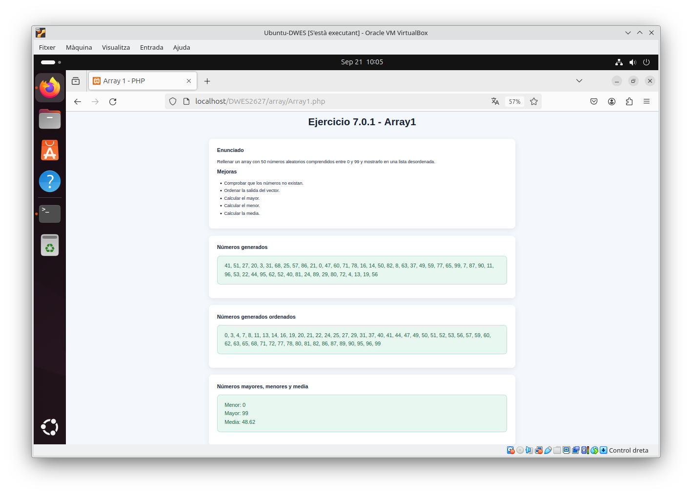
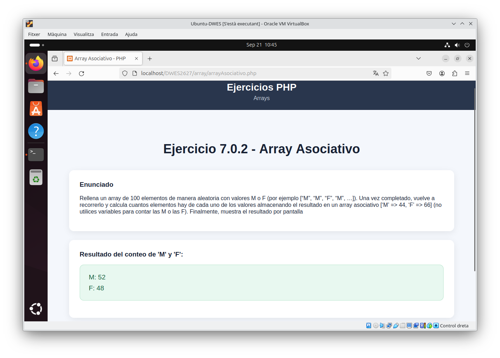
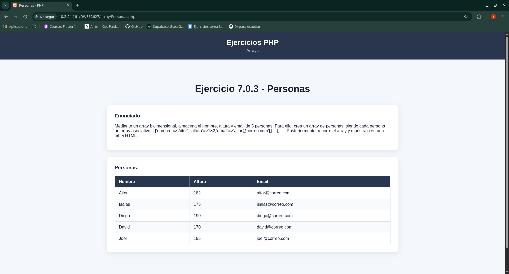
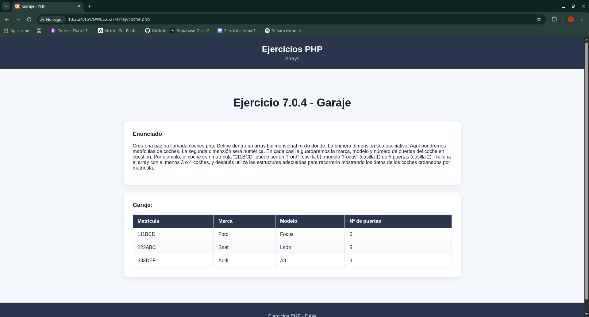
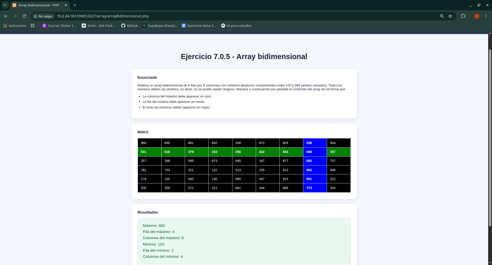

# Ejercicios con arrays - PHP

Ejercicios de arrays realizados durante el tema de PHP.

---

## Ejercicio 7.0.1 - Array1.php

---

## Ejercicio 7.0.2 - arrayAsociativo.php

---

## Ejercicio 7.0.3 - Personas.php

---

## Ejercicio 7.0.4 - coches.php

---

## Ejercicio 7.0.5 - arrayBidimensional.php

