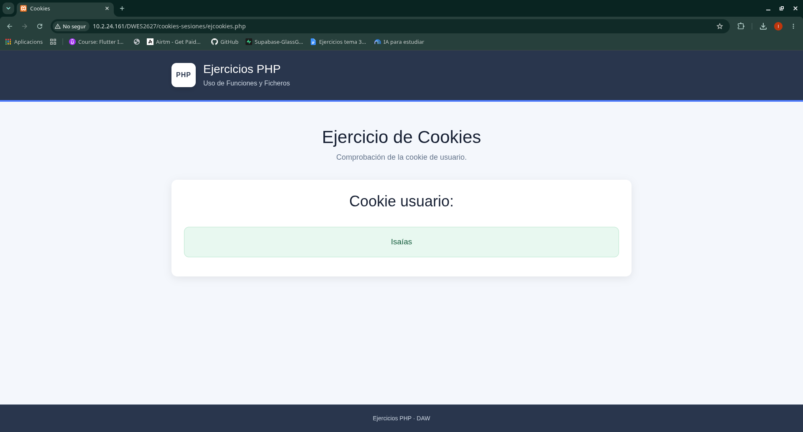

# Ejercicios - Cookies

Ejercicios realizados durante el apartado de **Cookies y Sesiones** de la asignatura Desarrollo Web en Entorno Servidor (DWES).

---

## Ejercicio - Cookies

### Enunciado

**ejcookies.php**

Realizar una aplicación que compruebe si existe la cookie `user` y tiene datos, vuestro nombre. En caso de estar vacía, que la cree con una caducidad de 1000.

En la siguiente ejecución debe de aparecer vuestro nombre en el navegador.

### Resultado

