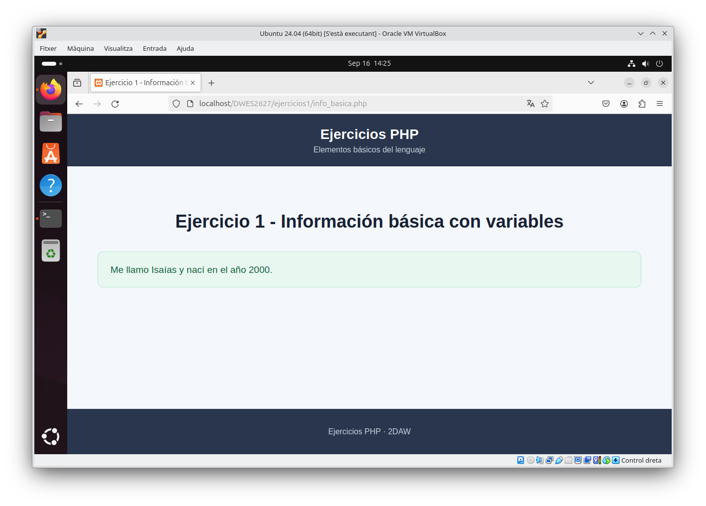
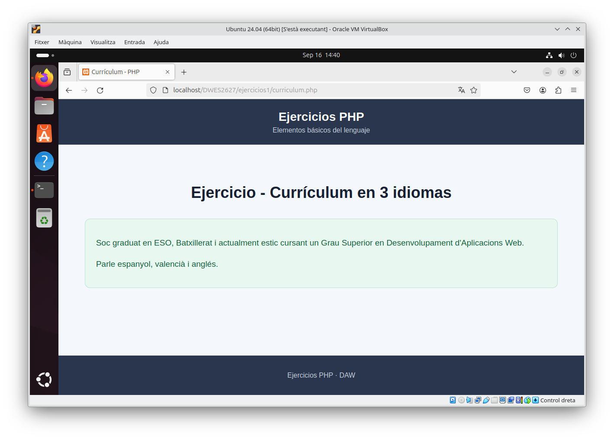
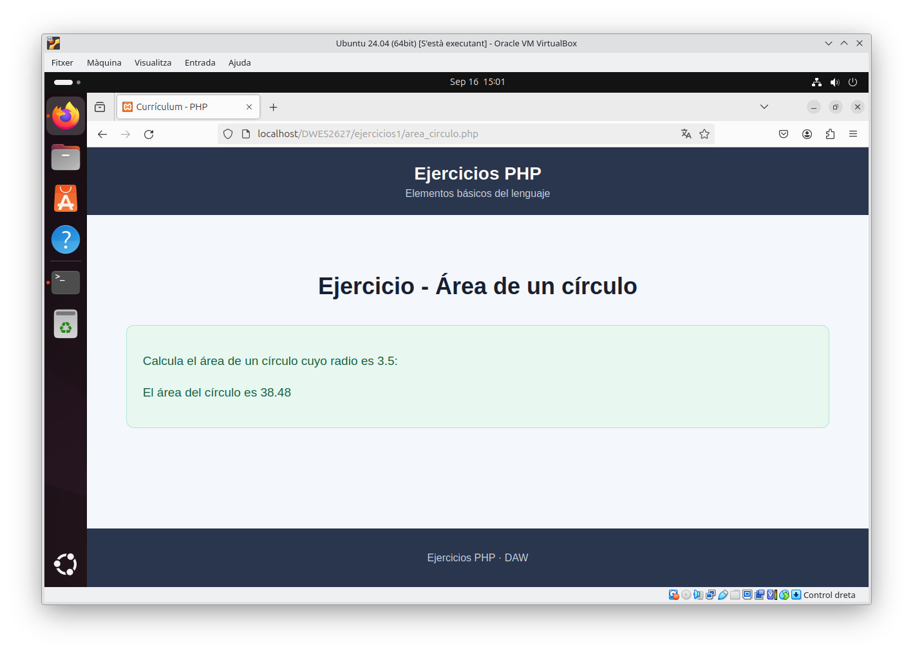
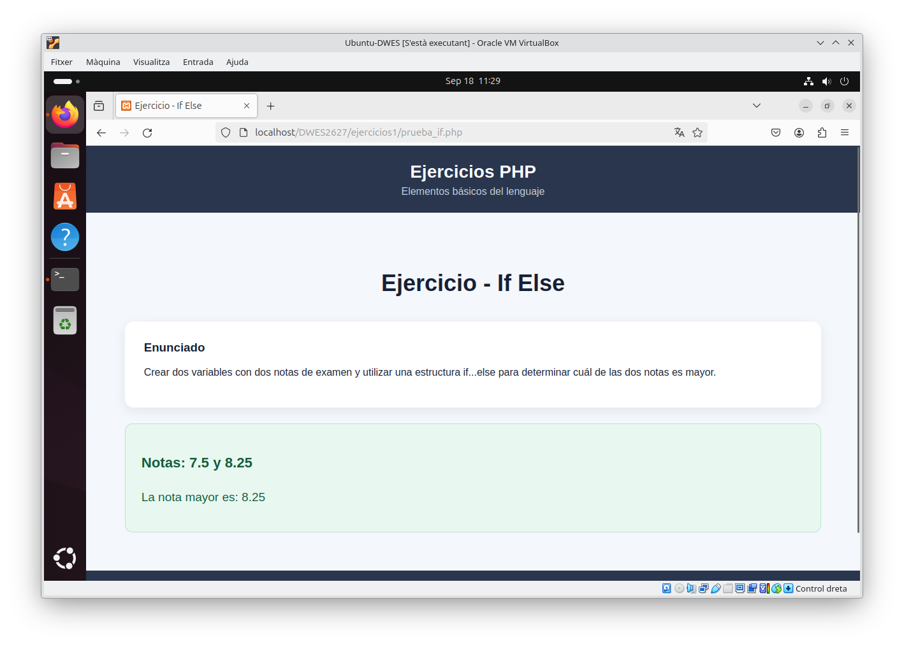

# Ejercicios 1 - PHP

Ejercicios básicos de PHP realizados durante el tema de **Elementos básicos del lenguaje**.

---

## Ejercicio - Información básica

### Enunciado

Crear una página `info_basica.php` que utilice dos variables para almacenar el nombre y el año de nacimiento y los muestre en una frase.

### Captura del resultado

---

## Ejercicio - Curriculum

### Enunciado

Crear una página `curriculum.php` utilizando variables variables para mostrar parte del currículum, como los estudios y los idiomas, en español, valenciano y otro idioma.

### Captura del resultado

---

## Ejercicio - Área de un círculo

### Enunciado

Crear una página `area_circulo.php` que utilice una variable `$radio` con el valor `3.5`.

Definir la constante `PI` y calcular en otra variable el área del círculo utilizando la fórmula `PI * radio²`.

Finalmente, mostrar por pantalla el texto "El área del círculo es XX.XX", donde `XX.XX` corresponde al resultado del cálculo con dos decimales.

### Captura del resultado

---

## Ejercicio - Mayor de dos notas

### Enunciado

Crear una página `prueba_if.php` con dos variables llamadas `$nota1` y `$nota2`, con dos notas de examen cualesquiera.

Después, utilizar una estructura `if...else` para determinar qué nota es la mayor.

### Captura del resultado

## Ejercicio - Mayor de tres notas

### Enunciado

Modificar el ejercicio anterior añadiendo una tercera nota `$nota3` y determinar cuál de las tres notas es la mayor utilizando una estructura `if..elseif..else`.

### Captura del resultado

