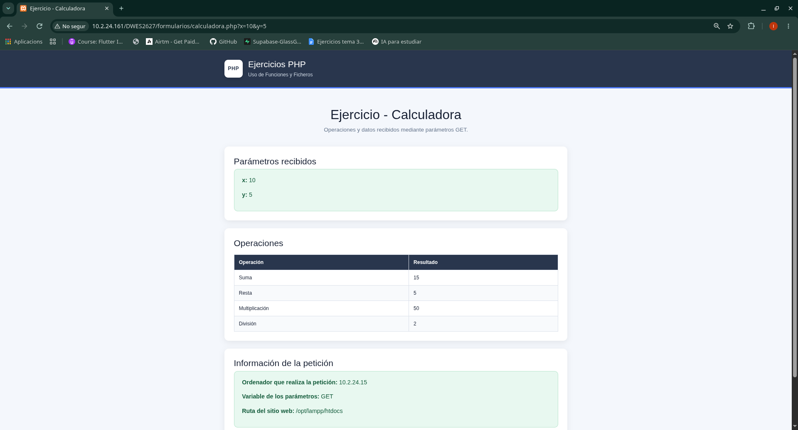
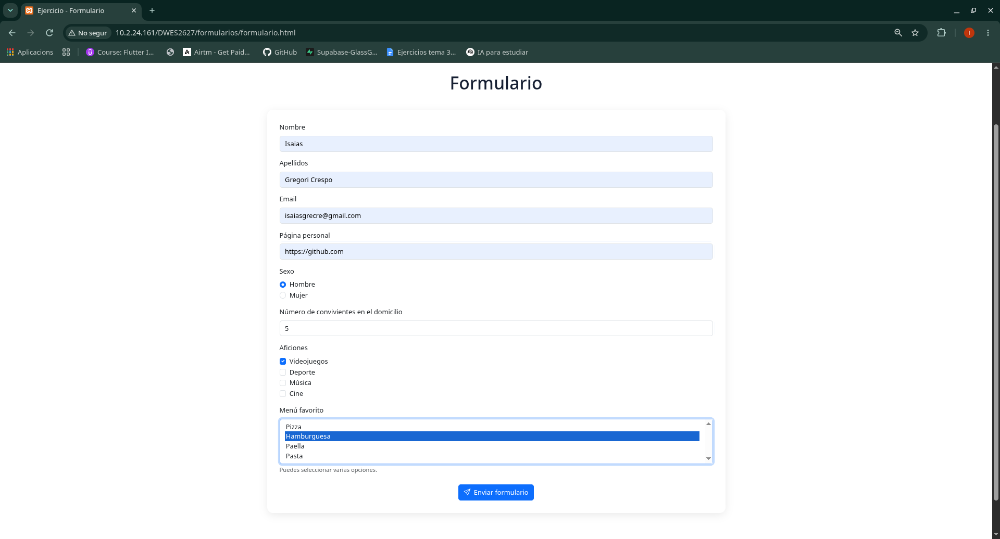
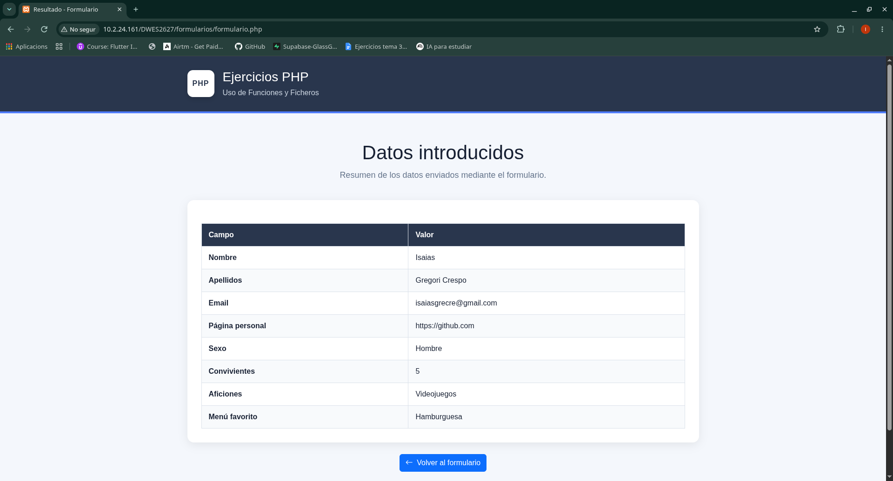
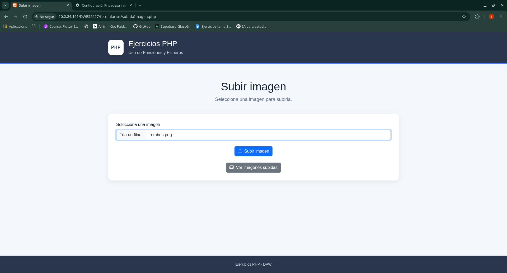
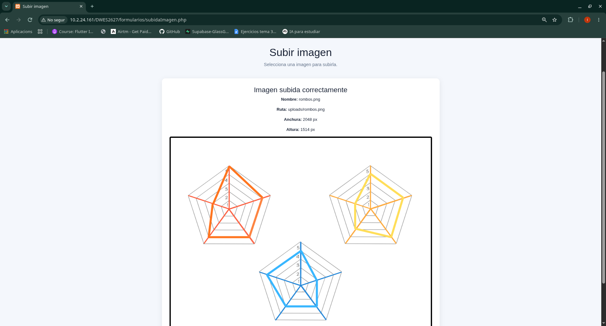
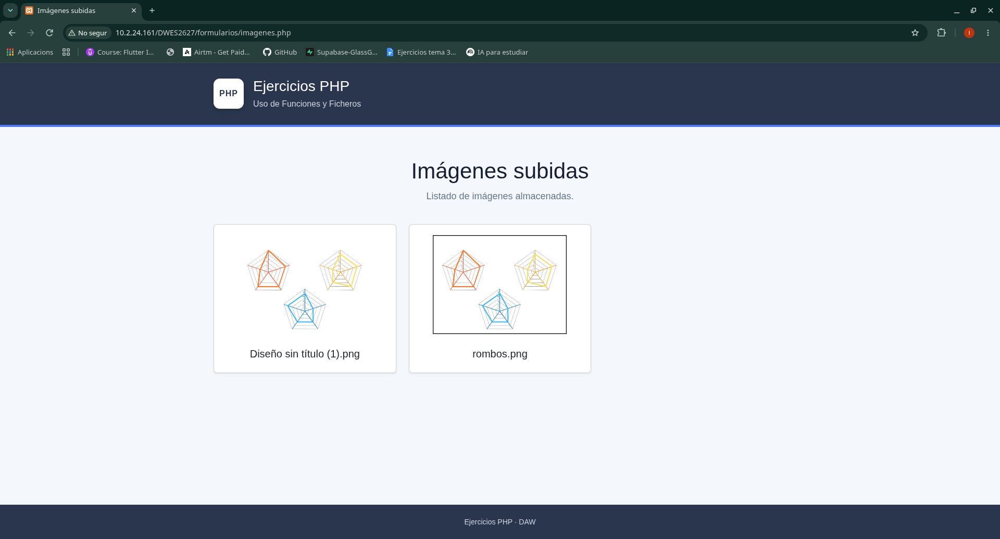

# Ejercicios - Formularios

Ejercicios realizados durante el apartado de **Trabajando con Formularios** de la asignatura Desarrollo Web en Entorno Servidor (DWES).

---

## Ejercicio - Calculadora

### Enunciado

Escribe un programa `calculadora.php` que acepte por la dirección las variables `$x` y `$y` y muestre por pantalla:

- El valor del array `$_GET` utilizando la función `print_r()`.
- La suma, resta, multiplicación y división de `x` e `y`.
- Los valores de la variable `$_SERVER`.
- El ordenador que hace la petición.
- En qué variable están los parámetros de la petición.
- La ruta del sitio web en el ordenador local.
- Utilizar una vista para mostrar el resultado: `calculadora.view.php`.

### Resultado

---

## Ejercicio - Formulario

### Enunciado

**formulario.html y formulario.php**

Crea un formulario (utiliza bootstrap) que solicite:

- Nombre y apellidos.
- Email.
- URL página personal.
- Sexo (radio).
- Número de convivientes en el domicilio.
- Aficiones (checkboxes) => poner mínimo 4 valores.
- Menú favorito (lista selección múltiple) => poner mínimo 4 valores.
- Muestra los valores cargados en una tabla-resumen.

### Resultado

---

## Ejercicio - Subida de imágenes

### Enunciado

**subidaImagen.php**

(utiliza bootstrap)

Crea un formulario que permita subir unicamente imágenes (comprueba la propiedad type del archivo subido). Si el usuario selecciona otro tipo de archivos, se le debe informar del error y permitir que suba un nuevo archivo.

En el caso de subir el tipo correcto, visualizar la imagen durante 5 segundos, con la ruta y nombre, tamaño de anchura y altura y redirecciona al formulario.

También hay que crear un enlace para mostrar el listado de todas las imágenes subidas. (analiza/estudia el método `scandir()`).

### Resultado

