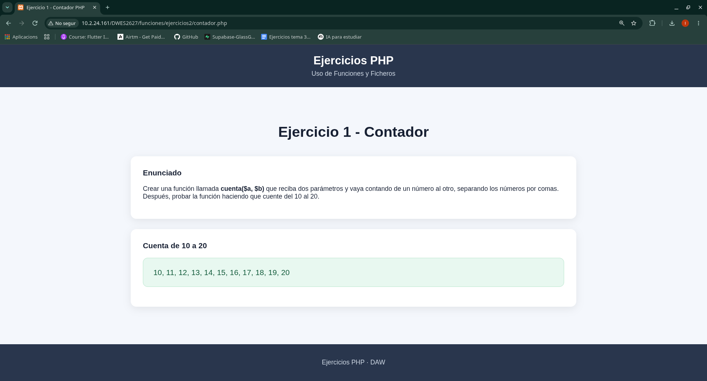
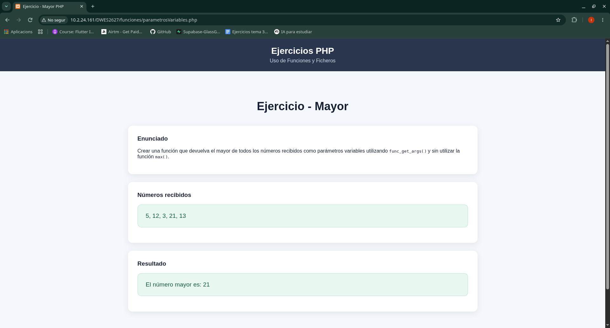

# Ejercicios - Funciones y Ficheros

Ejercicios realizados durante el tema de **Uso de Funciones y Ficheros** de la asignatura Desarrollo Web en Entorno Servidor (DWES).

---

## Ejercicio 1 - Contador

---

## Ejercicio 2 - Intercambia

---

## Ejercicio - Mayor

