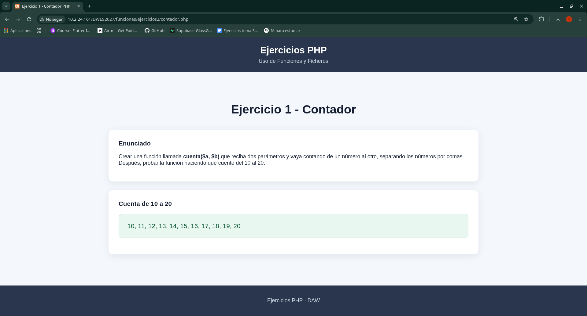
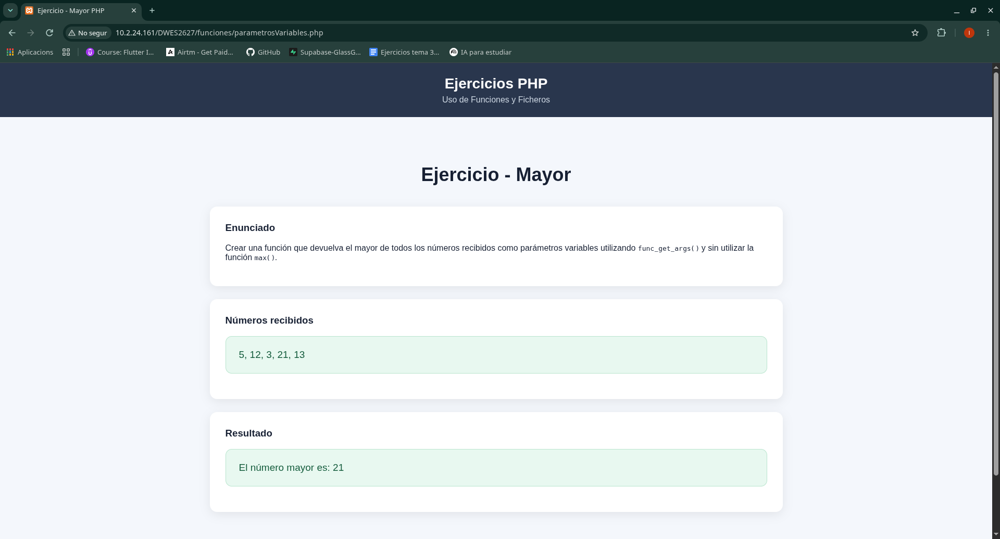
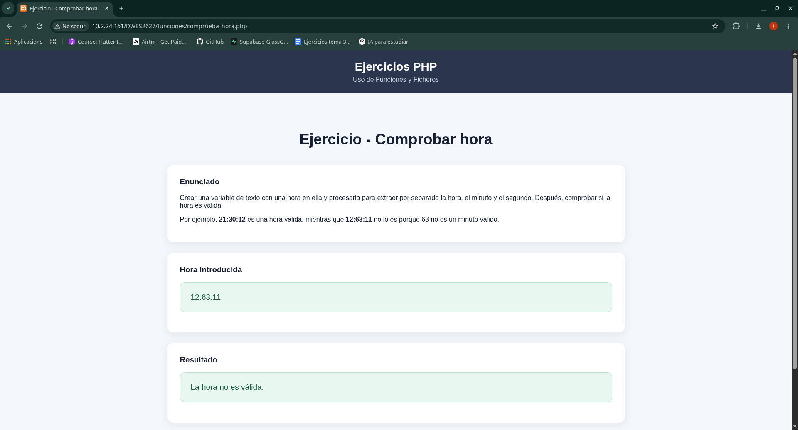
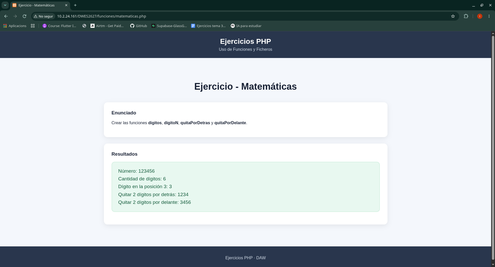
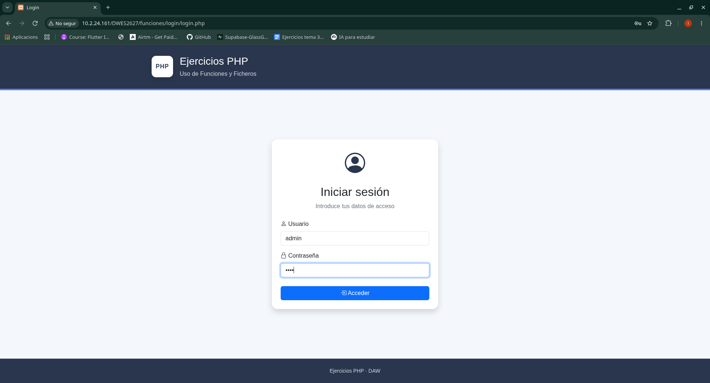
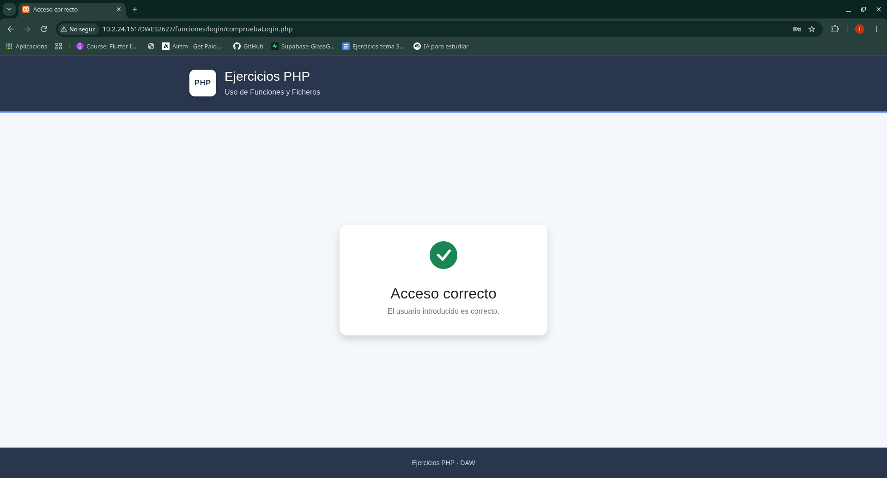
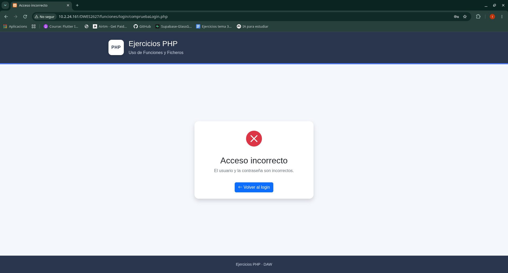

# Ejercicios - Funciones y Ficheros

Ejercicios realizados durante el tema de **Uso de Funciones y Ficheros** de la asignatura Desarrollo Web en Entorno Servidor (DWES).

---

## Ejercicio 1 - Contador

---

## Ejercicio 2 - Intercambia

---

## Ejercicio - Mayor

---

## Ejercicio - Comprobar hora

---

## Ejercicio - Matemáticas

---

## Ejercicio - Login

### Funcionamiento y procedimiento

En este ejercicio se simula un formulario de acceso mediante un usuario y una contraseña.

El ejercicio se ha separado en varios archivos para distinguir el formulario, la lógica de comprobación y las diferentes vistas:

- `login.php`: muestra el formulario donde se introducen el usuario y la contraseña.
- `compruebaLogin.php`: recibe los datos enviados mediante `POST` y comprueba si el usuario existe y si la contraseña es correcta utilizando un array asociativo.
- `ok.php`: muestra el resultado cuando el usuario y la contraseña son correctos.
- `ko.php`: muestra el resultado cuando los datos introducidos no son correctos.

### Formulario de acceso

### Acceso correcto

### Acceso incorrecto

### Diseño

Para mejorar la presentación del ejercicio he utilizado **Bootstrap** y **Bootstrap Icons**, manteniendo los estilos y la paleta de colores definidos en `styles.css`.
