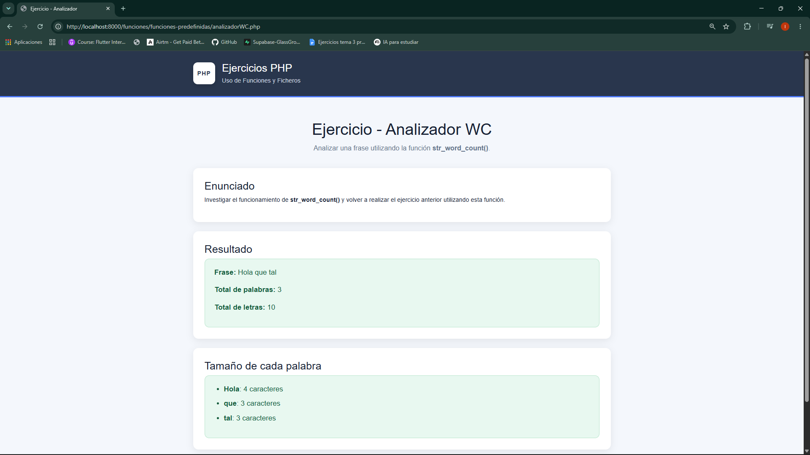
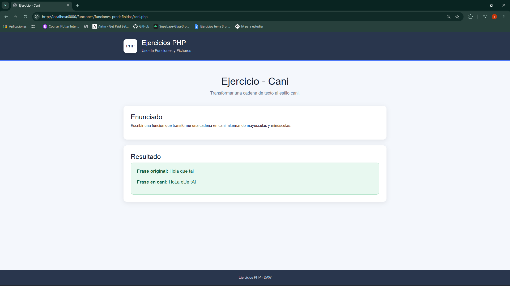
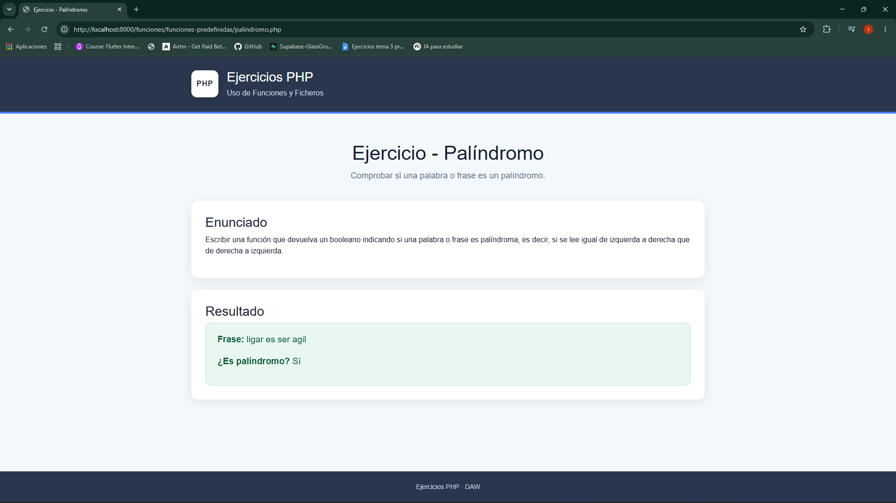

# Ejercicios - Funciones Predefinidas

Ejercicios realizados durante el apartado de **Funciones Predefinidas** de la asignatura Desarrollo Web en Entorno Servidor (DWES).

---

## Ejercicio - Frase Impares

---

## Ejercicio - Analizador

---

## Ejercicio - Analizador WC

---

## Ejercicio - Cani

---

## Ejercicio - Palíndromo

